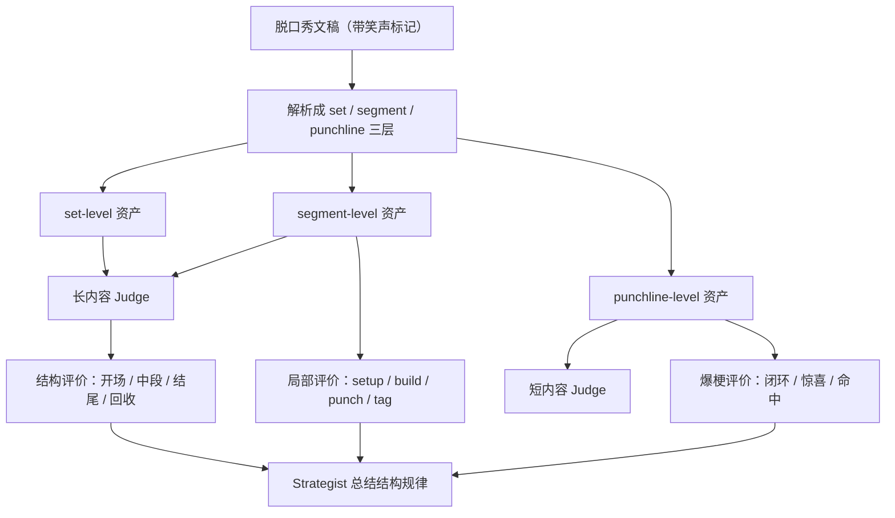

# HumorRL 脱口秀 Judge 框架

## 目标

当脱口秀成为 HumorRL 的主内容后，Judge 不该再只是“给一整篇稿子打个总分”。

它至少要同时理解三件事：

1. 整篇段子的结构是否成立
2. 哪些局部段落是真正在工作，哪些只是铺垫或过渡
3. 哪一句、哪一组句子，真正触发了观众笑声

这份框架的核心目标是：

- 把脱口秀从“长文本”升级成“结构化喜剧对象”
- 让现有 Judge 从短梗打分，逐步升级到整篇脱口秀评价
- 让带笑声标注的文稿，变成 Judge 的高价值外部认知资产

---

## 一、为什么这份脱口秀文稿很有价值

相较于普通笑话合集，这份 [脱口秀文稿合集.docx](/Users/milo/Downloads/脱口秀文稿合集.docx) 有三个额外价值：

1. 它不是只有文本，还有弱标注的观众反应
2. 它同时覆盖整篇段子和局部爆梗
3. 它天然包含“铺垫 -> 递进 -> 爆梗 -> 回收”的真实舞台结构

文稿里已明确写出：

- `[笑]`
- `[爆笑]`
- `[爆笑/欢呼]`
- `[掌声]`

这意味着它不是普通语料，而是一种弱标注数据集：

- `[笑]`：轻度有效笑点
- `[爆笑]`：强笑点
- `[爆笑/欢呼]`：高峰笑点
- `[掌声]`：不一定是好笑，可能是认同、情绪、价值表达

所以它最重要的价值不是“给 Generator 模仿风格”，而是：

**给 Judge 建立“什么地方真的打中了观众”的结构认知。**

---

## 二、脱口秀 Judge 需要的三层对象

脱口秀 Judge 不应该只面对“整篇文本”这一种对象。

它应该同时处理三层对象：

1. `set-level`
2. `segment-level`
3. `punchline-level`

---

## 三、第一层：set-level（整篇段子）

### 定义

`set-level` 指一整篇脱口秀段子。

例如：

- 付航《激情改变人生》
- 毛豆《治晕船》
- 翟佳宁总决赛段落

### Judge 在这一层看什么

不是只问“整篇好不好笑”，而是看：

1. 开场是否足够快进入状态
2. 第一个笑点出现是否太晚
3. 笑点是否持续存在，而不是中段塌陷
4. 递进是否增强，而不是平铺直叙
5. 结尾是否形成回收或高峰
6. 整篇是否有人设统一、主题统一

### 这一层适合输出的字段

- `set_score`
- `opening_strength`
- `middle_density`
- `ending_strength`
- `callback_quality`
- `persona_consistency`
- `structure_summary`
- `best_segment`
- `weakest_segment`

### 这一层的主要用途

- 长内容 Judge 主评分
- Strategist 复盘整篇结构问题
- 发现“这篇稿子是整体不行，还是局部包袱不行”

---

## 四、第二层：segment-level（段落单元）

### 定义

`segment-level` 指整篇段子里，一个相对完整的局部推进单元。

它通常由以下几类构成：

- setup（前提）
- bridge（过渡）
- build（递进）
- punch（包袱）
- tag（补刀）
- callback（回扣）

### 为什么这一层重要

因为脱口秀里最常见的问题，不是“整篇完全烂”，而是：

- 开场慢
- 中段松
- 某一段递进失败
- 结尾力度不足
- 包袱本身成立，但前提给得不好

这些问题如果只看整篇，很容易混在一起。

### 建议的 segment 划分方式

以笑声标记为边界，再结合上下文拆段：

- `[笑]` 前的 1-3 句，通常是本次笑点的 setup/build
- `[笑]` 前最后一句，通常接近 punch
- `[笑]` 后紧跟的 1-2 句，可能是 tag 或 callback

可以先按下面的粗规则切：

1. 从上一个笑声标记后，到下一个笑声标记前，视为一个 segment block
2. 再在 block 内拆：
   - 前半：setup / bridge
   - 后半：punch / tag

### 这一层适合输出的字段

- `segment_role`
- `segment_funny_score`
- `segment_laugh_level`
- `segment_is_setup`
- `segment_is_punch`
- `segment_is_tag`
- `segment_transition_quality`
- `segment_reason`

### 这一层的主要用途

- 给长内容 Judge 提供局部结构依据
- 帮 Strategist 找到“哪种推进方式有效”
- 帮 Generator 学“前提怎么立、梗怎么接”

---

## 五、第三层：punchline-level（爆梗单元）

### 定义

`punchline-level` 指真正触发笑声的一句话，或非常短的一组句子。

例如：

- “别人都什么情感类、搞笑类、颜值类，我是灵长类。”
- “我说大王饶命。”
- “那你就继续晕吧。”

### 为什么这一层最适合喂短内容 Judge

因为短内容 Judge 最需要知道的是：

- 什么样的一句话能打中
- 什么样的前提后接法能形成闭环
- 什么样的局部反转能产生笑声

而整篇段子直接喂给短内容 Judge，会丢掉太多结构信息。

### 这一层适合抽取的数据

每个爆梗单元最好带：

- `setup_text`
- `punch_text`
- `tag_text`
- `laugh_marker`
- `laugh_level`
- `mechanism_tags`
- `persona_tag`
- `topic_tag`

### 这一层的主要用途

- 训练短内容 Judge
- 建立爆梗库
- 帮 Generator 学局部闭环而不是抄整段

---

## 六、笑声标记如何变成 Judge 信号

这份文稿的笑声标记不应直接等于绝对分数，但可以变成强弱等级。

### 建议的弱监督映射

- `[笑]` -> `laugh_level = 1`
- `[爆笑]` -> `laugh_level = 2`
- `[爆笑/欢呼]` -> `laugh_level = 3`
- `[掌声]` -> `reaction_level = applause`
- `[爆笑/掌声]` -> `laugh_level = 2.5`

### 注意

`掌声` 不应简单视为“更好笑”。

很多掌声其实表示：

- 认同
- 价值感
- 情绪支持
- 人设认可

所以建议拆成两个信号：

- `laugh_intensity`
- `audience_approval`

Judge 未来应该学会区分：

- 这是喜剧爆点
- 这是观点得到认同
- 这是演员人格得到支持

---

## 七、这份语料最适合教 Judge 学什么

### 1. 学“前提”是什么

前提不是废话，而是：

- 给观众建立预期
- 给后面的反转创造条件

Judge 要学会识别：

- 前提是否清楚
- 前提是否过长
- 前提是否服务包袱

### 2. 学“爆梗”是什么

不是所有有转折的句子都算爆梗。

一个有效爆梗通常具备：

- 预期被带起来
- 反转点明确
- 闭环够快
- 语言够利落
- 情境真实

### 3. 学“递进”是什么

很多脱口秀不是靠一个梗，而是靠：

- 同一设定不断升级
- 同一情绪不断加码
- 同一角色不断出新反应

Judge 要学会判断：

- 是递进
- 还是重复

### 4. 学“回收”是什么

结尾如果能把前面的设定、人设、梗重新拉回来，常常会形成高质量收束。

Judge 需要学会识别：

- callback
- 收束
- 尾梗

---

## 八、对现有 Judge 的直接帮助

这份文稿短期内对系统最直接的帮助有 4 个。

### 1. 帮长内容 Judge 学结构

目前长内容 Judge 已有：

- `structure_summary`
- `best_moment`
- `weakest_moment`

但它还缺真实的舞台结构参照。

这份文稿能补上：

- 第一个笑点出现位置
- 每段笑点密度
- 哪些段子靠递进，哪些靠单点爆
- 哪些结尾强，哪些中段更强

### 2. 帮短内容 Judge 学局部爆点

可从 `[笑] / [爆笑]` 前后切出爆梗样本，作为：

- 高质量短内容参考
- setup -> punch 对照样本
- tag / callback 样本

### 3. 帮 Strategist 学“脱口秀机制”

Strategist 可以总结：

- 哪类前提更有效
- 哪类爆梗更容易引发强笑
- 哪些掌声是因为观点，而非喜剧效果
- 哪类文本是“简单真相”，哪类只是文字游戏

### 4. 帮 display track 更像舞台认知

展示轨未来不该只显示一个分数，还可以显示：

- 第一笑点出现速度
- 高笑点数量
- 是否有爆笑高峰
- 结尾是否回收

---

## 九、建议的数据资产结构

这份文稿不建议直接整包塞给 Judge。

建议拆成三套资产。

### A. `standup_sets.json`

整篇段子数据。

每条包含：

- `performer`
- `title`
- `full_text`
- `segments`
- `laugh_markers`
- `set_tags`
- `estimated_opening_lag`
- `peak_laugh_count`

用途：

- 长内容 Judge
- Strategist 复盘

### B. `standup_segments.json`

段落单元数据。

每条包含：

- `set_id`
- `segment_index`
- `role`
- `text`
- `next_laugh_level`
- `is_transition`
- `is_callback`
- `topic_tags`

用途：

- 结构分析
- 递进分析
- 长内容局部判断

### C. `standup_punchlines.json`

爆梗单元数据。

每条包含：

- `set_id`
- `setup_text`
- `punch_text`
- `tag_text`
- `laugh_level`
- `mechanism_tags`
- `audience_type`

用途：

- 短内容 Judge
- 爆梗库
- 爆梗定位训练

---

## 十、Judge 的推荐工作流

---

## 十一、Phase 1 到 Phase 3 的落地顺序

### Phase 1

先做最小闭环：

1. 从文稿中抽取 `set-level`
2. 保留笑声标记
3. 用它来增强长内容 Judge 的结构认知

目标：

- Judge 能理解“整篇段子不是一块铁板”

### Phase 2

开始拆 `segment-level`

1. 以笑声标记为边界切段
2. 标粗略角色：setup / punch / tag / callback
3. 用来增强长内容 Judge 的局部结构判断

目标：

- Judge 能指出哪一段在工作，哪一段拖后腿

### Phase 3

开始做 `punchline-level`

1. 抽出爆梗局部闭环
2. 建立短内容爆梗库
3. 反向喂给短内容 Judge 和 Generator

目标：

- 短内容 Judge 能更像“舞台笑点识别器”

---

## 十二、核心判断

如果脱口秀是主内容，那么这份带笑声标记的文稿：

- 不是可有可无的参考资料
- 也不是单纯的“优质范文”
- 而是 Judge 最有价值的外部认知资产之一

因为它第一次让系统看到：

- 观众在哪里笑
- 哪种笑更强
- 一个段子不是只有“整体好不好笑”，而是由前提、递进、爆梗、回收共同组成

一句话说：

**这份文稿最适合拿来训练 Judge 学“舞台上的幽默结构”，而不是拿来让 Generator 学“复述稿子”。**

---

## 十三、笑声与掌声的正确参考逻辑

这份文稿最容易被误用的地方，就是把笑声标记直接理解成文本分数。

这是不对的。

Judge 必须明确区分：

- 文本质量
- 结构作用
- 表演放大
- 观众认同

### 1. 笑声不是文本真值

文稿中的：

- `[笑]`
- `[爆笑]`
- `[爆笑/欢呼]`
- `[掌声]`

不能直接等于：

- “这句文本一定高分”
- “这句文本一定比没笑的句子更重要”

因为真实舞台反应可能同时来自：

- 文本本身成立
- 演员表演强
- 停顿节奏好
- 人设已经立住
- 前面积累足够，情绪在这里释放
- 现场气氛被带起来

所以它们不是“文本标准答案”，而是“舞台结果痕迹”。

### 2. 它真正提供的是结构证据

这份文稿最有价值的，不是告诉 Judge：

`哪里笑了，所以这句就是高分句。`

而是告诉 Judge：

- 这个位置在真实舞台上触发了反应
- 这个位置之前铺了什么
- 这个位置之后接了什么
- 哪些不笑的句子在为后面的笑服务
- 哪些段子是慢热型，哪些是密集型
- 哪些结尾形成了高峰

Judge 应该用它学习：

**什么结构更容易在舞台上成立。**

### 3. 没笑的句子也可能非常重要

没有笑声标记的内容，不应直接视为无效文本。

很多句子虽然不直接引发笑声，但可能承担：

- 建立人设
- 交代处境
- 制造预期
- 铺垫反转条件
- 推动递进
- 给结尾回收做准备

所以在长内容 Judge 里：

- “没笑”不等于“没用”
- 很多不笑的句子，其实是高价值结构组件

### 4. 掌声不等于好笑

`[掌声]` 很多时候代表的不是纯喜剧效果，而是：

- 认同
- 情绪共振
- 价值表达
- 人设支持

所以掌声在 Phase 1 应该：

- 记录位置
- 作为额外上下文
- 不直接当成 Judge 的笑点强分信号

更合适的长期拆法是：

- `laugh_intensity`
- `audience_approval`

但在早期实现里，先只保留这个概念区分，不急着做复杂双分系统。

### 5. Judge 应该学习四类舞台作用

未来 Judge 面对脱口秀文本时，应该逐步学会区分四类内容：

#### A. 文本直接有效

即使脱离表演，也能明显看出笑点成立。

#### B. 结构性有效

本句不一定直接好笑，但对后续爆点成立非常关键。

#### C. 表演放大有效

文本本身一般，但演员表演和节奏能显著放大效果。

#### D. 认同性有效

不一定是“笑”，但能赢得掌声、支持和情绪认同。

这四类如果不区分，Judge 很容易学歪。

### 6. 对系统的实际指导

因此，这份脱口秀文稿最正确的使用方式是：

- 不把笑声直接映射成绝对分数
- 不把有笑标记的句子直接当满分样本
- 优先把它作为：
  - 长内容结构参考
  - 笑点位置参考
  - 递进和回收参考
  - Segment / Punchline 候选抽取参考

一句话总结：

**笑声和掌声提供的是舞台成立性的证据，不是文本质量的最终真值。**
